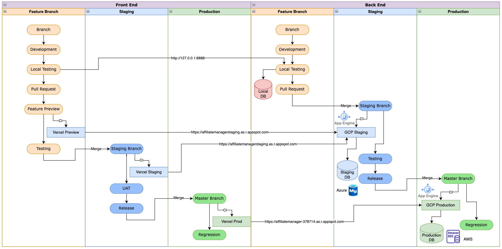

<h1 align = "center"> AffiliateManager </h1>
<p align="center"></p>

<div align="center">

[](https://github.com/aaronangxz/AffiliateManager/actions/workflows/test.yml)

</div>

<div align="center">This is the backend server implementation of AffiliateManager.</div>

<h2> Development </h2>

1. Prepare an `.env` file under project root with the following credentials
    ```
    PROD_DB_HOST= <Hostname of production DB>
    PROD_DB_PORT= <Port of production DB>
    PROD_DB_USERNAME= <Username of production DB>
    PROD_DB_PASS= <Password of production DB>
    PROD_REDIS_HOST= <Hostname of production Redis>
    PROD_REDIS_PASS= <Password of production Redis>
    TEST_DB_HOST= <Hostname of staging DB>
    TEST_DB_PORT= <Port of staging DB>
    TEST_DB_USERNAME= <Username of staging DB>
    TEST_DB_PASS= <Password of staging DB>
    TEST_REDIS_HOST= <Hostname of staging Redis>
    TEST_REDIS_PASS= <Password of staging Redis>
    ENV= <current deployed environment>
    ACCESS_SECRET= <Hash key for access token>
    REFRESH_SECRET= <Hash key for refresh token>
    GMAIL_CLIENT_ID= <Client Id of Gmail auth>
    GMAIL_CLIENT_SECRET= <Client Secret of Gmail auth>
    GMAIL_ACCESS_TOKEN= <Access token of Gmail auth>
    GMAIL_REFRESH_TOKEN= <Refresh token of Gmail auth>
    STRIPE_SECRET_KEY= <Secret Key of Stripe>
    ```
2. `go mod download` to download dependencies.
3. `go run main.go` to start server.
4. Server can be accessed from `localhost:8888`

<h2> Deployment </h2>



<h3> Default Deployment </h3>

Automated deployment to GCP App Engine has been configured, and will be triggered on every push to `master` and `staging`.

<h3> Manual Deployment </h3>

To deploy manually, `gcloud app deploy`

<h2> Automated Test Suite </h2>

<h3> Default Test Run </h3>

Automated test suite will be triggered on every push or PR to `master` and `staging`.

[Workflow jobs](https://github.com/aaronangxz/AffiliateManager/actions/workflows/test.yml)

<h3> Manual Test Run</h3>

To run locally, `go test -v ./...`

<h2> Infrastructure </h2>

<h3>Production</h3>

| Resource | Platform                                        | 
|----------|-------------------------------------------------|
| Server   | <br/>GCP App Engine |
| Database | <br/>AWS RDS           |
| Cache    | <br/>Redis Cloud     |

<h3>Staging</h3>

| Resource | Platform                                        | 
|----------|-------------------------------------------------|
| Server   | <br/>GCP App Engine |
| Database | <br/>Azure SQL       |
| Cache    | <br/>Redis Cloud     |

<h2> Endpoints </h2>

| Service   | Method | Endpoint                             | Cache | 
|-----------|--------|--------------------------------------|-------|
| Affiliate | POST   | api/v1/affiliate/list                | Y     |
|           | GET    | api/v1/affiliate/:id                 | N     |
|           | POST   | api/v1/affiliate/stats               | Y     |
|           | POST   | api/v1/affiliate/trend               | Y     |
|           | GET    | api/v1/affiliate/ranking/list        | N     |
| Referral  | POST   | api/v1/referral/list                 | Y     |
|           | GET    | api/v1/referral/:id                  | N     |
|           | POST   | api/v1/referral/stats                | Y     |
|           | POST   | api/v1/referral/trend                | Y     |
|           | GET    | api/v1/referral/recent/list          | N     |
| User      | GET    | api/v1/user/info                     | N     |
| Booking   | POST   | api/v1/booking/list                  | N     |
| Landing   | GET    | api/v1/booking/slots/available       | N     |
| Tracking  | POST   | api/v1/welcome/click                 | N     |
|           | POST   | api/v1/welcome/checkout              | N     |
| Payment   | POST   | api/v1/payment/create-payment-intent | N     |
| Platform  | POST   | api/v1/platform/register             | N     |
|           | POST   | api/v1/platform/login                | N     |
|           | POST   | api/v1/platform/logout               | N     |

